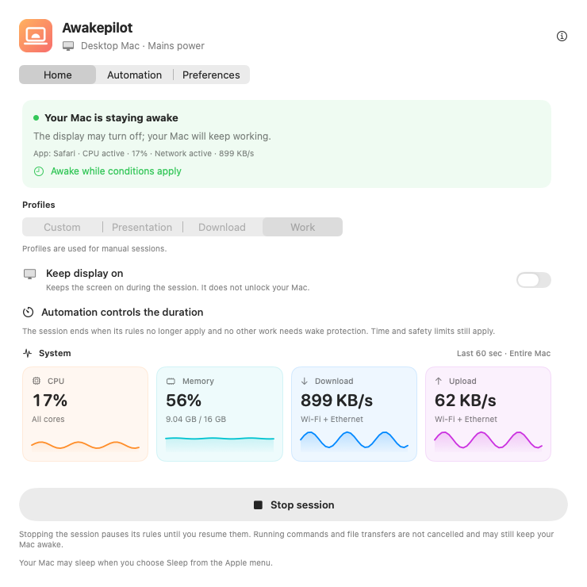
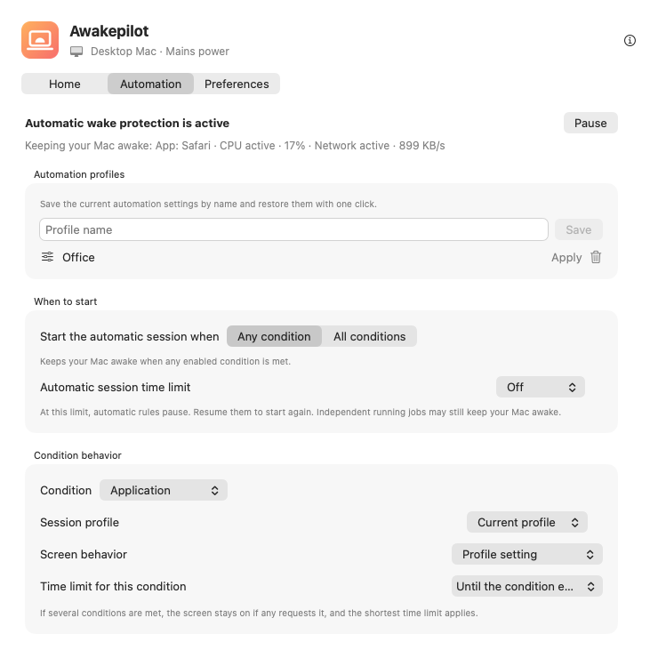
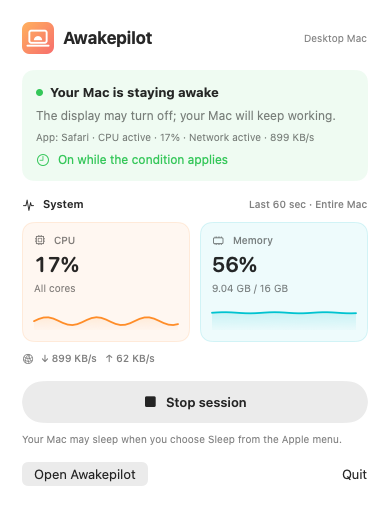
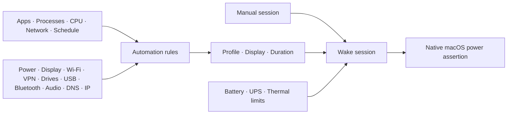

<div align="center">
  
  <h1>Awakepilot</h1>
  <p><strong>Keep your Mac awake only while the work needs it.</strong></p>
  <p>
    A native macOS menu bar utility for precise wake sessions, work-aware
    automation, long-running commands, transfers, external drives, and presentations.
  </p>
</div>

<p align="center">
  
  
</p>

<p align="center">
  
  
  
</p>

<p align="center">
  <a href="https://awakepilot.codentum.net/download/Awakepilot.dmg"><strong>Download Awakepilot</strong></a>
  · <a href="https://awakepilot.codentum.net/"><strong>Website</strong></a>
  · <a href="https://awakepilot.codentum.net/support.html"><strong>Support</strong></a>
  · <a href="https://awakepilot.codentum.net/releases.html"><strong>Release notes</strong></a>
</p>

The [product website](https://awakepilot.codentum.net/) matches all ten application
languages: English, German, Spanish, Turkish, French, Azerbaijani, Italian, Brazilian
Portuguese, Japanese, and Korean. Each language includes localized app screenshots,
pricing, support, privacy information, and the complete release history.

---

## Wake control that follows real work

Traditional keep-awake tools usually provide a timer and leave the rest to the user.
Awakepilot can follow the work itself. It starts and stops wake protection from observable
conditions such as a running application, an active terminal process, sustained CPU or
network activity, a schedule, Wi-Fi, VPN, connected USB or Bluetooth devices, the
active audio output, DNS servers, IP networks, external power, an attached display,
or a mounted external drive.

The result is predictable: the Mac remains available while the selected work continues,
then returns to normal macOS sleep behavior when the active reasons end.

The menu bar clock shows the current state without opening a window:

- **Outline clock:** normal macOS sleep behavior is active.
- **Filled clock:** Awakepilot is holding a wake assertion.

<p align="center">
  
</p>

<table>
  <tr>
    <td align="center"><strong>Explainable automation</strong></td>
    <td align="center"><strong>Fast menu bar control</strong></td>
  </tr>
  <tr>
    <td></td>
    <td></td>
  </tr>
</table>

## Capabilities

| Area | What Awakepilot provides |
| --- | --- |
| Manual sessions | Run indefinitely, for a preset or custom duration, or until an exact date and time. |
| Display policy | Keep the display active or allow it to sleep while the Mac continues working. |
| Automation | Observe applications, processes, schedules, CPU, network, power, displays, Wi-Fi, VPNs, USB, Bluetooth, audio output, DNS, IP networks, and external drives. |
| Matching | Start when any enabled condition matches or require all enabled conditions to match. |
| Workflow profiles | Save complete automation configurations and restore them by name. |
| Per-condition behavior | Choose the session profile, display policy, and maximum duration for each signal type. |
| System metrics | Display live CPU, memory, download, and upload history in the menu bar and dashboard. |
| Drive Alive | Refresh an Awakepilot-owned marker on explicitly selected writable external drives. |
| Command protection | Keep the Mac awake for the exact lifetime of a command through bounded wake leases. |
| Safety | Pause for battery limits, UPS battery operation, critical thermal pressure, and duration limits. |
| Activity history | Keep a bounded local record of meaningful starts, stops, pauses, and condition changes. |
| Updates | Verify checksums, bundle identity, Developer ID, version, and Gatekeeper approval before installation. |
| Localization | Provide complete English, German, Spanish, French, Azerbaijani, Turkish, Italian, Brazilian Portuguese, Japanese, and Korean interfaces. |

## Manual sessions

Start a session from the menu bar or dashboard and select how long it should last.
Display behavior is independent from system wake behavior, so a download can continue
with the screen off while a presentation can keep both the system and display active.

| Profile | Display behavior | Default duration |
| --- | --- | --- |
| Presentation | Stays active | 1 hour |
| Download | May sleep | Unlimited |
| Work | May sleep | 2 hours |
| Custom | User-defined | User-defined |

Manual sessions remain independent from automation. A session ends at its deadline,
when explicitly stopped, or when a configured safety rule pauses wake protection.

## Work-aware automation

Awakepilot evaluates enabled conditions approximately every five seconds and also reacts
to relevant system events. CPU and network rules have independent cooldown periods to
avoid rapid start-stop cycles. Schedules follow local time and support ranges that cross
midnight.

Every condition reports why it is waiting, active, cooling down, or paused. When multiple
conditions match, Awakepilot combines their policies consistently: the most conservative
maximum duration applies, and a request to keep the display on takes precedence.



### Connected hardware and network context

Choose a USB or paired Bluetooth device to keep the Mac awake while that device is
connected. Audio rules follow the selected output route, such as a USB audio interface
or headphones. Network-context rules match exact DNS server addresses, IPv4 or IPv6
addresses, or CIDR networks. Each condition can use its own session profile, display
policy, and maximum duration.

Bluetooth rules require the standard macOS Bluetooth permission. Device names and
network rules stay on the Mac and are excluded from diagnostic exports.

### Reusable workflow profiles

A workflow profile stores the complete automation configuration rather than a single
timer. Profiles make it practical to switch between recurring contexts such as remote
work, large transfers, media exports, presentations, or development builds.

### Drive Alive

Drive Alive is available for explicitly selected writable external volumes. It refreshes
only `.awakepilot-drive-alive`, includes an ownership signature, and removes its marker
when disabled. An unrelated file with the same name is never overwritten.

## Live system context

Optional menu bar indicators show CPU, memory, download, and upload activity with compact
colored graphs. Each indicator can be enabled independently from the right-click menu.
The dashboard provides the same metrics with a longer recent history.

These measurements are used locally. They are not sent to an analytics service.

## Command-line and automation control

The bundled `awakepilotctl` client supports terminal workflows, scripts, and Shortcuts.
It uses the same validated command model as the `awakepilot://` URL scheme.

```sh
/Applications/Awakepilot.app/Contents/MacOS/awakepilotctl start --minutes 90 --profile work
/Applications/Awakepilot.app/Contents/MacOS/awakepilotctl status --json
/Applications/Awakepilot.app/Contents/MacOS/awakepilotctl extend 30
/Applications/Awakepilot.app/Contents/MacOS/awakepilotctl stop
```

Protect a command only for its process lifetime:

```sh
/Applications/Awakepilot.app/Contents/MacOS/awakepilotctl run \
  --name "Release build" --ttl 4h -- make release
```

The wake lease is released when the command exits. Orphaned leases are detected, and
every lease has a maximum time to live of 24 hours.

## Power and thermal safeguards

- Sessions on MacBook can require external power or pause below a battery threshold.
- UPS-aware sessions can pause while the UPS supplies battery power.
- Critical thermal pressure releases the wake assertion immediately.
- Automatic sessions can enforce a hard maximum duration.
- Choosing **Sleep**, critical battery protection, and supported closed-display behavior
  remain under macOS control.

Awakepilot uses native macOS power-management assertions. It does not make persistent
`pmset` changes and does not require administrator privileges.

## Privacy by design

Awakepilot contains no advertising, analytics SDK, tracking pixel, or behavioral
telemetry. Settings and activity history stay in the current macOS user account.
Awakepilot 0.14.2 and later check for updates and downloads official packages from
`awakepilot.codentum.net`. Public releases through 0.14.1 continue to use GitHub Releases.

Diagnostic reports are created only after an explicit save action. They exclude command
text, command output, private file paths, Wi-Fi names, volume names, workflow profile
names, device names, DNS servers, IP rules, watched applications and processes,
license credentials, and activity history.

Read the full [privacy policy](https://awakepilot.codentum.net/privacy.html).

## Verified updates

Before replacing an installed version, Awakepilot verifies:

1. the expected release asset and version;
2. the SHA-256 digest;
3. bundle identifier `com.harun.awakepilot`;
4. Developer ID team identifier `CHS5258JRU`;
5. a strict code-signing assessment; and
6. Gatekeeper approval.

The existing application is backed up during replacement and restored if installation
cannot complete.

With automatic checks enabled, Awakepilot checks every 24 hours while it remains open
and checks after wake when a check is due. Updates are installed only when you choose.
Version 0.14.1 closes the About window before quitting for installation and reports an
error if the app cannot quit.

When updating from 0.14.0 or earlier, if the updater stays on **Installing update** for
more than a minute, close **About and Updates** and quit Awakepilot from its menu bar
menu. A prepared update will finish installing and relaunch the app. If it does not,
install the latest official DMG from the link below.

## Installation

**Requirements:** macOS 13 Ventura or later on Apple Silicon or Intel.

1. Download the latest [signed and Apple-notarized DMG](https://awakepilot.codentum.net/download/Awakepilot.dmg).
2. Open the disk image.
3. Drag **Awakepilot** into **Applications**.
4. Launch Awakepilot and use the clock icon in the menu bar.

Awakepilot does not add a Dock icon. It follows the language selected in **System
Settings → General → Language & Region**, including app-specific language settings.

## Support

- [Installation and troubleshooting](https://awakepilot.codentum.net/support.html)
- [Release history](https://awakepilot.codentum.net/releases.html)
- [Report a reproducible problem](https://github.com/ninjaBlume/awakepilot/issues/new/choose)
- [Security policy](SECURITY.md)

When reporting a problem, include the Awakepilot version, macOS version, Mac model, and
clear reproduction steps. Review diagnostic files before publishing them and remove any
information considered confidential.

## Repository scope

Awakepilot is proprietary software distributed directly as a Developer ID-signed and
Apple-notarized application. This public repository provides:

- signed release packages and checksums;
- the official product website and support documentation;
- release history and update metadata;
- public issue tracking; and
- the security-reporting policy.

Application source code, signing credentials, fulfillment services, and private build
infrastructure are maintained separately.
